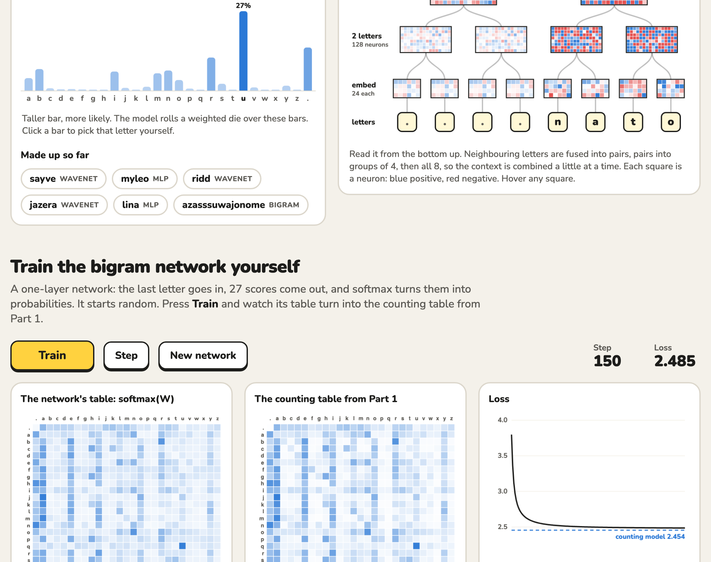
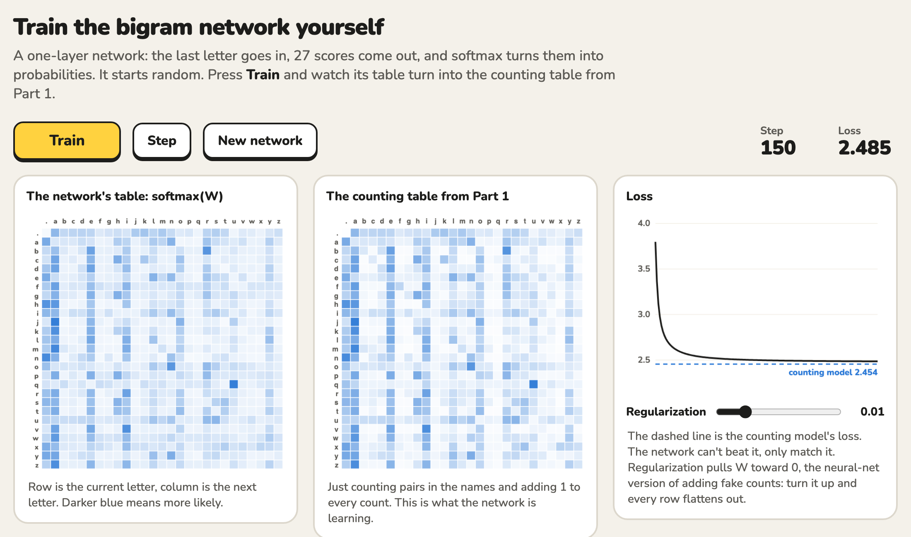

# Watch a Model Make Up Names

**[▶ Try it live](https://kenneth13he.github.io/learning-basics-of-gpt/)**

An interactive page where three language models I trained make up new names one letter at a time. You see what each model can see, how likely every next letter is, and what's happening inside the network as it decides.

The models follow Andrej Karpathy's [makemore](https://github.com/karpathy/makemore) lectures: a bigram model that sees 1 letter, an MLP that sees 3, and a WaveNet that sees 8. They're trained in PyTorch on 32,000 real names, then exported so they run right in your browser.



## What you can do

- **Make up names.** Pick a model and press **Generate** to watch a name appear letter by letter. Compare the bigram's `azasssuwajonome` with the WaveNet's `sayve` and `jazera`.
- **See what the model sees.** Yellow tiles show the letters the model is looking at: 1 for the bigram, 3 for the MLP, 8 for the WaveNet.
- **Pick letters yourself.** The bar chart shows the probability of every possible next letter. Click any bar to choose that letter and see how the model reacts.
- **Look inside the model.** Each model has its own diagram. Hover any square to see its value.
  - **Bigram:** its 27×27 table of letter-pair probabilities.
  - **MLP:** letters → embeddings → 200 hidden neurons → next-letter scores.
  - **WaveNet:** a tree that fuses letters into pairs, then groups of 4, then all 8.
- **Train a network yourself.** Press **Train** to watch a one-layer network learn the same table you get by counting letter pairs. Its loss settles on the counting model's 2.454. A slider lets you turn up regularization and watch every row flatten out.
- **See what the models learned.** A letter map plots each letter's learned embedding in 2D. The vowels end up near each other, even though no model was ever told which letters are vowels.



## How it works

Every model predicts the next letter from the letters before it. Generating a name is a loop:

1. **Context:** take the last few letters. A name starts with `.` padding, which marks the start.
2. **Forward:** run them through the model to get 27 scores, one for each letter and one for `.` (end of name).
3. **Softmax:** turn the scores into probabilities.
4. **Sample:** pick a letter at random, weighted by those probabilities. Stop when `.` is picked.

`export-weights.py` runs my training scripts, then saves the trained weights to `docs/models.json`. The page reimplements each forward pass in JavaScript. Its probabilities match PyTorch's to within 0.0001; the tiny difference comes from rounding the weights to 4 decimal places.

The "Train the bigram network yourself" section really does train in your browser. It uses gradient descent with the gradient worked out by hand: `(row count × predicted probability − actual count) / total`, plus the regularization term.

## Results

Loss is the average of −log(probability the model gave the real next letter). Lower is better.

| Model | File | Sees | Parameters | Loss |
|---|---|---|---|---|
| Random guessing | | | | 3.30 |
| Bigram (counting) | `makemore-bigram-basic.py` | 1 letter | 729 | 2.45 |
| Bigram (neural net) | `bigram-neural-network.py` | 1 letter | 729 | 2.49 |
| MLP | `makemore-mlp.py` | 3 letters | 11,897 | 2.17 |
| Deep MLP + BatchNorm | `makemore-batchnorm.py` | 3 letters | 47,024 | 2.08 |
| MLP with hand-written backprop | `makemore-backprop-ninja.py` | 3 letters | 12,297 | 2.11 |
| WaveNet | `makemore-wavenet.py` | 8 letters | 76,579 | **1.99** |

The MLP and later models are measured on names they never trained on.

## Files

| File | What it does |
|---|---|
| `makemore-bigram-basic.py` | Part 1: counts letter pairs into a table, samples names from it, and measures the loss |
| `bigram-neural-network.py` | Part 1: trains a one-layer neural network that learns the same table |
| `makemore-mlp.py` | Part 2: an MLP with learned letter embeddings that sees 3 letters |
| `makemore-batchnorm.py` | Part 3: a 6-layer network with Kaiming initialization and BatchNorm, plus plots of activations and gradients |
| `makemore-backprop-ninja.py` | Part 4: every gradient written by hand, checked against PyTorch, then used to train without `loss.backward()` |
| `makemore-wavenet.py` | Part 5: a WaveNet that combines 8 letters in a tree |
| `export-weights.py` | Runs the bigram, MLP and WaveNet scripts and saves their trained weights for the page |
| `docs/index.html` | The interactive page |
| `docs/models.json` | The exported weights |
| `makemore-explained.md` | A study guide for Parts 3 to 5 |
| `names.txt` | The dataset: 32,033 names |

## Run it locally

The page has to be served over HTTP, because opening the file directly blocks it from loading `models.json`:

```bash
python3 -m http.server -d docs
```

Then open http://localhost:8000.

To run any of the models from the command line:

```bash
python3 -m pip install torch matplotlib
python3 makemore-wavenet.py
```

Each training script takes a few minutes on a CPU. After retraining, rebuild the page's weights with:

```bash
python3 export-weights.py
```

## How I built it

- I learned how language models work by following Andrej Karpathy's [Neural Networks: Zero to Hero](https://karpathy.ai/zero-to-hero.html) lectures on makemore, Parts 1 to 5 (the [makemore](https://github.com/karpathy/makemore) repo is MIT licensed).
- The web interface was built with guidance from Claude Code.
